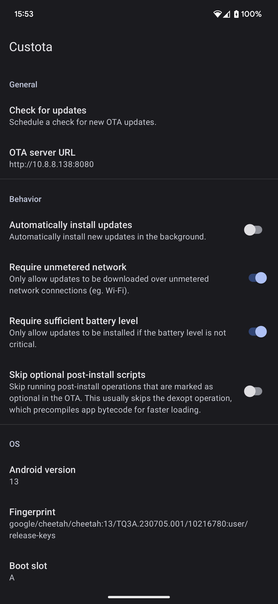

# Custota


Custota is an app for installing Android A/B OTA updates from a custom OTA server. When paired with [avbroot](https://github.com/chenxiaolong/avbroot), it can be used to seamlessly install OTAs signed by a custom key.

Custota is installed via a Magisk/KernelSU module so that it can run as a system app.

 

## Features

* Supports Android 13 and newer
* Supports pausing, resuming, and cancelling updates
* Supports skipping optional post-install scripts to speed up updates
* Never communicates with any server besides the configured OTA server
* OTA updates safely continue running even if the app crashes or is uninstalled during the operation

## Limitations

* The device must support A/B updates.
  * This notably excludes all Samsung devices.
* Incremental updates are not supported.
  * It would take minimal work to add support, but there's currently no tooling to generate an incremental OTA from two full OTAs.
* Pre-downloading an update to install later is not supported.
  * Custota runs `update_engine` in streaming mode, which downloads and installs OTAs at the same time.
* The stock OS' Settings app on Pixel devices always launches the builtin OTA updater.
  * These shortcuts in the Settings app are loaded from GmsCore (part of Google Play Services) via a mechanism called "settings slices" and cannot be overridden. Apps that launch the OTA updater via the standard `android.settings.SYSTEM_UPDATE_SETTINGS` intent will show a prompt to pick between Custota or the builtin OTA updater.

## Usage

1. Follow the instructions in the [OTA server](#ota-server) section to set up a webserver and generate the metadata files for the OTA zips.

    Alternatively, Custota supports installing OTAs from a local directory instead of downloading them from an OTA server. When using a local directory, the expected directory structure is exactly the same as how it would be with a server.

2. If you're installing OTA updates signed with a custom key, follow the instructions in the [Custom Verification Key](#custom-verification-key) section.

3. Download the latest version from the [releases page](https://github.com/chenxiaolong/Custota/releases). To verify the digital signature, see the [verifying digital signatures](#verifying-digital-signatures) section.

4. Install the Custota module in Magisk/KernelSU.

5. Reboot and open Custota.

6. Set the OTA server URL to point to your OTA server.

7. That's it!

Once the OTA server URL is configured, Custota will automatically check for updates periodically. The checks can be turned off completely or extended to automatically install the updates as well.

To reduce battery usage, the scheduling of the update checks is controlled by Android. They run at most once every 6 hours and will not run at all if the `Require unmetered network` or `Require sufficient battery level` conditions aren't met.

## OTA server

Custota only requires a basic webserver capable of serving static files and supporting the HTTP `Range` header. Any standard webserver, like Apache, Nginx, or Caddy, will do the trick. For testing, Caddy is very useful because it can serve files from a directory without setting up any config files:

```bash
caddy file-server --access-log --listen :8080 --root /path/to/ota/directory
```

The following static files need to be hosted:

* OTA zip
    * The filename can be anything.
* Csig ("Custota signature") file
    * This is a file that contains a digital signature of the metadata sections of the OTA. This allows Custota to securely read the OTA's metadata without downloading the entire zip.
    * The filename can be anything, but is commonly `<ota filename>.csig`.
* Update info JSON
    * This contains the path or URL to the `.zip` and `.csig` files.
    * The filename _**must**_ be `<device codename>.json`.

To generate the csig and update info files:

1. Download `custota-tool` from the [release page](https://github.com/chenxiaolong/Custota/releases). Binaries are provided for Linux, Windows, and Mac. To compile from source instead, follow the [instructions here](#building-custota-tool).

2. Generate the csig file from the OTA zip. The keypair that was used to sign the OTA can also be used to create the csig.

    ```bash
    ./custota-tool \
        gen-csig \
        --input path/to/ota.zip \
        --key path/to/ota.key \
        --cert path/to/ota.crt
    ```

    If the OTA was signed with a different keypair, use `--cert-verify` to specify the certificate for verifying the OTA. This is not needed if the OTA and csig are signed with the same keypair.

    The csig will be saved to `<input>.csig`. `-o`/`--output` can be used to specify a different output path.

    If the private key is encrypted, an interactive prompt for the passphrase will be shown. For automation, see `--help` for information on providing the passphrase via an environment variable or a file.

3. Create the update info JSON file.

    ```bash
    ./custota-tool \
        gen-update-info \
        --file <device codename>.json \
        --location <ota filename>.zip
    ```

    The location can be set to:

    * A relative path (computed starting from the directory containing the update info file). This is the easy option if the update info, OTA, and csig files are all stored in the same directory tree. Subdirectories are supported.
    * A full URL. This is useful if the OTA and csig files are stored on different servers (eg. cloud object storage).

    By default, the csig location is set to `<location>.csig`. This can be changed with the `-c`/`--csig-location` option.

    If needed, this file can be easily edited by hand.

### HTTPS

To use a self-signed certificate or a custom CA certificate, it needs to be installed into the system CA trust store. To generate a module that does this, run the following command and then flash the generated module zip.

```bash
custota-tool gen-cert-module -o system-ca-certs.zip /path/to/cert.pem
```

## Custom verification key

Android's `update_engine` verifies OTA signatures against certificates contained within `/system/etc/security/otacerts.zip`. If your OTAs were signed by a custom key via avbroot, make sure it was done with avbroot 3.0.0 or newer, which added support for patching the system partition's copy of `otacerts.zip` (instead of just the recovery partition's copy).

## Permissions

* `ACCESS_CACHE_FILESYSTEM` (**automatically granted by system app permissions**)
  * Needed to store temporary OTA files.
* `ACCESS_NETWORK_STATE` (**automatically granted at install time**)
  * Needed on Android 14+ for unmetered network background run condition.
* `FOREGROUND_SERVICE`, `FOREGROUND_SERVICE_SPECIAL_USE` (**automatically granted at install time**)
  * Needed to run the OTA update service in the background.
* `INTERNET` (**automatically granted at install time**)
  * Needed to communicate with the OTA server. Custota **does not and will never** communicate with any server outside of the configured OTA server. There are no ads, analytics, or any sort of tracking.
* `MANAGE_CARRIER_OEM_UNLOCK_STATE`, `MANAGE_USER_OEM_UNLOCK_STATE`, `READ_OEM_UNLOCK_STATE` (**automatically granted by system app permissions**)
  * Needed to show the bootloader unlock status.
* `POST_NOTIFICATIONS` (**must be granted by the user**)
  * Android requires a notification to be shown in order for the updater service to reliably run in the background.
* `REBOOT` (**automatically granted by system app permissions**)
  * Needed to reboot the device when the user explicitly presses the reboot button in Custota's notification after an update is installed.
* `RECEIVE_BOOT_COMPLETED` (**automatically granted at install time**)
  * Needed to schedule periodic update checks
* `WAKE_LOCK` (**automatically granted at install time**)
  * Needed to keep the CPU awake while an update is being installed.

## Advanced features

### Debug mode

Custota has hidden debug options that can be enabled or disabled by long pressing the version number.

### Logs

To access the Custota's logs, enable debug mode and press `Open log directory` to open the log directory in the system file manager (DocumentsUI). Or alternatively, browse to `/sdcard/Android/com.chiller3.custota/files` manually.

* `check.log`, `install.log`, and `revert.log`: Logs for the last check/install/revert operation.
* `crash.log`: Logs for the last crash.
* `/data/local/tmp/custota_selinux.log`: Logs for the SELinux changes made during boot.
  * This log cannot be saved to the normal log directory because it is written prior to the user unlocking the device for the first time after booting.

When reporting bugs, please include the log files as it is extremely helpful for identifying what might be going wrong. The logs should contain no sensitive information besides the OTA URLs.

(To monitor `update_engine`'s own logs, run `adb logcat '*:S' update_engine`.)

### Reinstallation

For testing, Custota can allow the current OS version (i.e. matching build fingerprint) to be reinstalled. To do so, enable debug mode and then enable the `Allow reinstall` toggle. Make sure to not enable `Automatically install updates` at the same time or else the current OS version will be reinstalled after every reboot because it's always seen as a valid update.

### Reverting an update

Normally, an update can be cancelled by presing the `Cancel` button in the notification while it is being downloaded or installed. However, if the opportunity to do so was missed and the update has already been installed, the update can be reverted by enabling debug mode and pressing the `Revert completed update` option. This stops the bootloader slot from being switched on reboot. Note that an update can only be reverted if the device hasn't been rebooted yet.

## How it works

The A/B update process in Android is handled by a builtin component called `update_engine`. The engine is used both for sideloading OTA updates when booted into recovery mode and for regular OTA updates while booted into Android. It is responsible for checking the signature of `payload.bin` inside the OTA zip against `/system/etc/security/otacerts.zip`, verifying existing partition checksums (for incremental updates), and then installing the payload. It also handles the download process when used in the streaming mode, which is always requested by Custota. Custota itself is responsible for the other parts, such as checking for updates, verifying compatibility, and preventing downgrades (which could cause the device to be unbootable due to Android Verified Boot's rollback index mechanism).

In order for Custota to talk to `update_engine` or even discover that the component exists, the SELinux policy must be modified to allow this access. The module ships with a [script](./app/module/post-fs-data.sh) that makes these modifications (non-persistently) on boot. This script is the only time root access is used.

There are two parts to the SELinux changes:

1. There's a [`custota_selinux` native executable](./app/src/main/cpp/custota_selinux) that performs all of the policy modifications. It takes the `untrusted_app` domain and makes a copy of it as `custota_app`. Then, it adds the relevant rules to allow only `custota_app` to access `update_engine`. The domain is copied from `untrusted_app` instead of the normal `priv_app` domain that is assigned to system apps because Custota does not require any of the additional privileges that would have been granted by `priv_app`.

2. An `seapp_contexts` rule is added to `/system/etc/selinux/plat_seapp_contexts`, which actually sets up the association between Custota (app package ID: `com.chiller3.custota`) and the new SELinux domain (`custota_app`).

These changes help limit Custota's privileges to exactly what is needed and avoids potentially increasing the attack surface via other apps.

### TLS trust store

Depending on the Android version, different components use different CA trust stores for validating certificates.

| Component                            | Trust store     |
|--------------------------------------|-----------------|
| Custota (Android >= 14)              | `apex`          |
| Custota (Android < 14)               | `system`        |
| `update_engine` (Android >= 14 QPR2) | `system`        |
| `update_engine` (Android < 14 QPR2)  | `system_google` |

Custota's module automatically bind mounts trust store directories on boot so that `update_engine` will use the same trust store that regular apps, including Custota, use. This way, there will never be a situation where, for example, Custota can download the OTA, but `update_engine` cannot.

| Android version     | Bind mount                  |
|---------------------|-----------------------------|
| < 14                | `system` -> `system_google` |
| >= 14 but < 14 QPR2 | `apex` -> `system_google`   |
| >= 14 QPR2          | `apex` -> `system`          |

### File formats

#### OTA zip

Custota uses Android's standard A/B OTA zip format with no additional changes.

#### csig (Custota signature)

The csig file contains a signed JSON message of the form:

```jsonc
{
    "version": 1,
    "files": [
        {
            "name": "payload_metadata.bin",
            "offset": 3954,
            "size": 148569,
            "digest": "d13b75ba16ab6bcd992b3e8d0f1964b3f4f65c9c39022afe684dd48312079eb7"
        },
        {
            "name": "payload.bin",
            "offset": 3954,
            "size": 2344888291,
            "digest": "62b73ad358b06eebd186fa7c9895ef40bfdaf97060ae572984783dfa91397fb3"
        },
        // ...
    ]
}
```

This is a copy of the `ota-property-files` data in `META-INF/com/android/metadata.pb`, except with an additional field for the SHA256 digest of each file entry's data. The file intentionally includes no other data because it's only meant to allow secure parsing of OTA metadata without downloading the entire file and verifying the whole-file signature.

Although it's never possible for a `payload.bin` signed by an untrusted key to be installed, csig prevents a new OTA's metadata from being attached to an old OTA's validly-signed payload for downgrade protection. This is because the csig info includes the digest for `payload_properties.txt`, which contains payload's own digests. This forms a strong tie between the csig and the payload.

The actual csig file is a DER-encoded CMS signature containing the JSON structure above in its encapsulated data. To display the encapsulated data, run:

```bash
openssl cms -verify -in <csig file> -inform DER -binary -noverify
```

To verify the csig's signature against a specific certificate, run:

```bash
openssl cms -verify -in <csig file> -inform DER -binary -CAfile <cert file>
```

#### Update info

The update info file is a JSON file of the form:

```jsonc
{
    "version": 2,
    "full": {
        "location_ota": "ota.zip",
        "location_csig": "ota.zip.csig"
    }
}
```

The file contains no metadata besides the location of the OTA and csig files. Each location field can be either a relative path (computed starting from the update info file's parent directory/URL) or a full URL.

### Update process

When Custota checks for updates, it will:

1. Download the update info file.
2. Download the csig file listed in the `location_csig` field.
3. Verify the signature of the csig. All further downloads of file entries in the csig are verified against the listed digests.
4. Download the `metadata.pb` entry and validate the fields to determine if the OTA is suitable for installation on the device.
5. Show the update prompt if the OTA fingerprint does not match the running system and the security patch level is newer than the running system.

When the user chooses to install an update, Custota will repeat all but the last step above and then:

1. Download the `payload_metadata.bin` entry (`payload.bin`'s header), write it to `/data/ota_package/payload_metadata.bin`, and ask `update_engine` to verify that the listed partition operations are suitable to be performed on the current device.
2. Download `care_map.pb` and write it to `/data/ota_package/care_map.pb`. This is unused for devices with virtual A/B partitioning (ie. snapuserd).
3. Download `payload_properties.txt`, parse the payload digests, and ask `update_engine` to download and install `payload.bin`.

## Verifying digital signatures

Both the zip file and the APK contained within are digitally signed.

### Verifying zip file signature

First, save the public key to a file listing the keys to be trusted.

```bash
echo 'custota ssh-ed25519 AAAAC3NzaC1lZDI1NTE5AAAAIDOe6/tBnO7xZhAWXRj3ApUYgn+XZ0wnQiXM8B7tPgv4' > custota_trusted_keys
```

Then, verify the signature of the zip file using the list of trusted keys.

```bash
ssh-keygen -Y verify -f custota_trusted_keys -I custota -n file -s Custota-<version>-release.zip.sig < Custota-<version>-release.zip
```

If the file is successfully verified, the output will be:

```
Good "file" signature for custota with ED25519 key SHA256:Ct0HoRyrFLrnF9W+A/BKEiJmwx7yWkgaW/JvghKrboA
```

### Verifying apk signature

First, extract the apk from the zip and then run:

```
apksigner verify --print-certs system/priv-app/com.chiller3.custota/app-release.apk
```

Then, check that the SHA-256 digest of the APK signing certificate is:

```
35749a70d9b855fe1a6262537db529fabc0ea24d1115ceb82835bf5a589578ae
```

## Building from source

### Building app and module

Custota can be built like most other Android apps using Android Studio or the gradle command line.

To build the APK:

```bash
./gradlew assembleDebug
```

To build the Magisk/KernelSU module zip (which automatically runs the `assembleDebug` task if needed):

```bash
./gradlew zipDebug
```

The output file is written to `app/build/distributions/debug/`. The APK will be signed with the default autogenerated debug key.

To create a release build with a specific signing key, set up the following environment variables:

```bash
export RELEASE_KEYSTORE=/path/to/keystore.jks
export RELEASE_KEY_ALIAS=alias_name

read -r -s RELEASE_KEYSTORE_PASSPHRASE
read -r -s RELEASE_KEY_PASSPHRASE
export RELEASE_KEYSTORE_PASSPHRASE
export RELEASE_KEY_PASSPHRASE
```

and then build the release zip:

```bash
./gradlew zipRelease
```

### Building custota-tool

Make sure the [Rust toolchain](https://www.rust-lang.org/) is installed. Then run:

```bash
cd custota-tool
cargo build --release
```

The output binary is written to `target/release/custota-tool`.

Debug builds work too, but they will run significantly slower (in the sha256 computations) due to compiler optimizations being turned off.

## Contributing

Bug fix and translation pull requests are welcome and much appreciated!

If you are interested in implementing a new feature and would like to see it included in Custota, please open an issue to discuss it first. I intend for Custota to be as simple and low-maintenance as possible, so I am not too inclined to add new features, but I could be convinced otherwise.

## License

Custota is licensed under GPLv3. Please see [`LICENSE`](./LICENSE) for the full license text.
